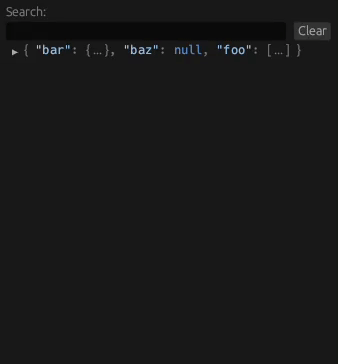

# egui_json_tree

An interactive JSON tree visualisation library for `egui`, with search and highlight functionality.

<p align="center">
  
</p>

## Usage

```rust
let value = serde_json::json!({ "foo": "bar", "fizz": [1, 2, 3]});
let tree = JsonTree::new("globally-unique-id", &value);

// Show the JSON tree:
let response = tree.show(ui, DefaultExpand::All);
```

See [demo.rs](./examples/demo.rs) for more detailed examples.

`JsonTree` can visualise any type that implements `Into<JsonTreeValue>`. An implementation to support `serde_json::Value` is provided with this crate. If you wish to use a different JSON type, see the `value` module, and disable default features in your `Cargo.toml` if you do not need the `serde_json` dependency.

## Run Examples

```bash
cargo run --example=demo
```

## Open Docs

```bash
cargo doc --no-deps --open
```

## Notes

This crate currently depends on an unpublished version of `egui` from the master branch, in order to expose the ability to reset the expanded state of arrays/objects in a ` JsonTree`. On the next `egui` release, this crate will update its `egui` dependency to the latest published version, and this crate will be published to `crates.io`.
